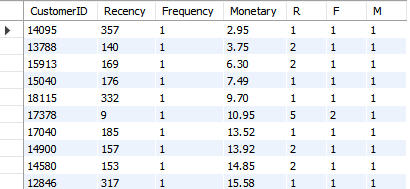
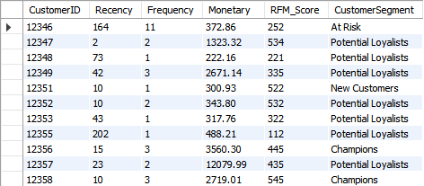
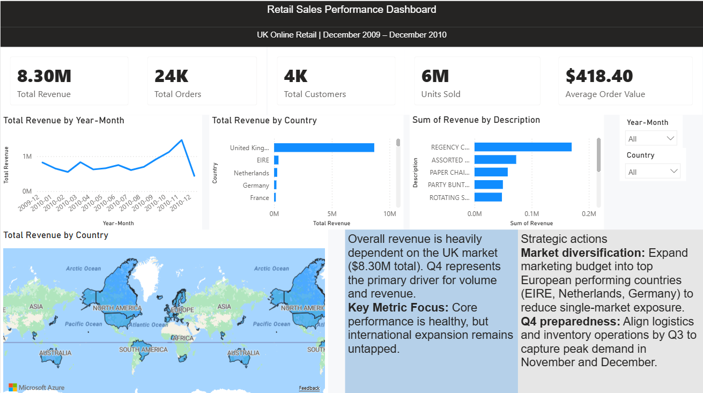
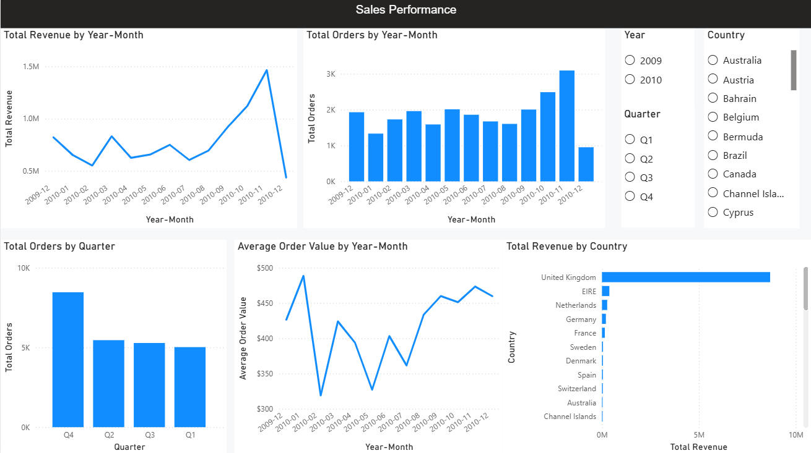
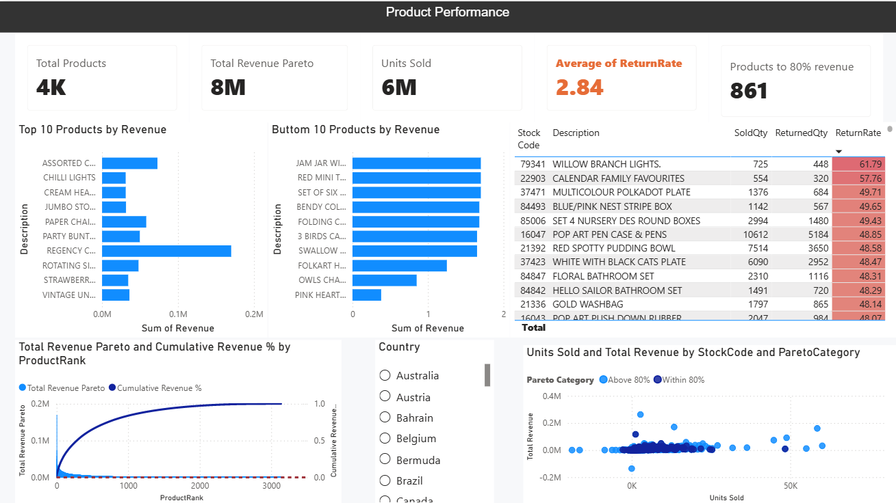
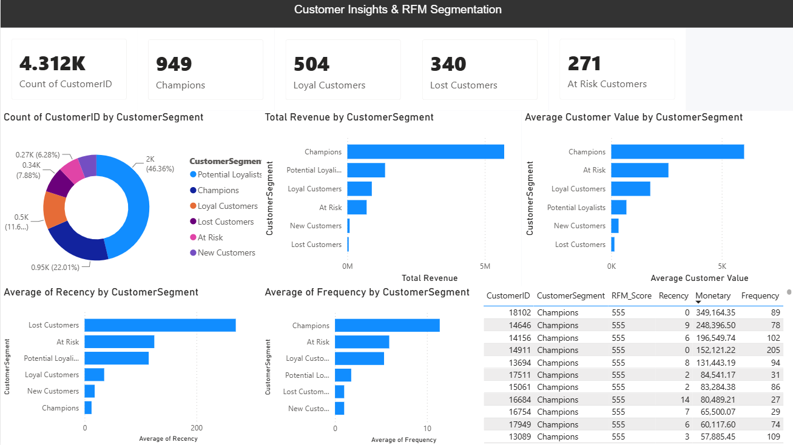
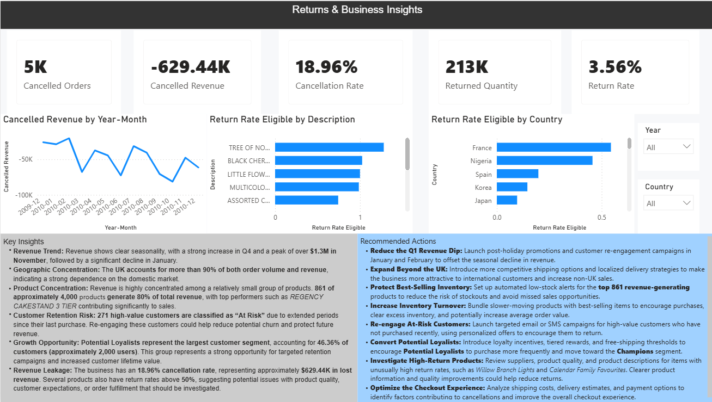

**Online Retail Sales & Customer Analysis**

This portfolio project analyzes sales, product performance, customer behavior, returns, and customer segmentation for an online retail business operating in the UK between  **December 2009 and December 2010** .

The project was developed as an end-to-end  **Business Analyst / Data Analyst portfolio project** , combining **Excel, MySQL, and Power BI** to transform raw transactional data into actionable business insights.

The analysis focuses on identifying revenue drivers, product concentration, customer value, return patterns, and opportunities for improving customer retention and business performance.

# **Business Objectives**

The main objectives of the analysis were to answer the following business questions:

* How is revenue distributed over time?
* Which products generate the highest revenue?
* Which products have the weakest sales performance?
* How concentrated is revenue across the product portfolio?
* What percentage of products generates approximately 80% of revenue?
* Which customers generate the highest monetary value?
* Which customers are most valuable to the business?
* Which customers are potentially at risk of churn?
* Which products have unusually high return rates?
* What are the main business opportunities and risks identified in the data?

# Dataset

The project uses the **Online Retail II** transactional dataset, representing transactions from a UK-based online retailer.

The dataset contains information such as:

| Column      | Description                             |
| ----------- | --------------------------------------- |
| Invoice     | Unique invoice / transaction identifier |
| StockCode   | Product identifier                      |
| Description | Product description                     |
| Quantity    | Number of units purchased               |
| InvoiceDate | Transaction date and time               |
| Price       | Unit price                              |
| CustumerID  | Customer identifier                     |
| Country     | Customer country                        |

## Data characteristics

* Transaction-level retail data
* UK-focused online retail business
* Approximately **500K+ cleaned transaction rows**
* Includes both completed and cancelled transactions
* Contains product, customer, transaction, and geographic information

# Tools & Technologies

**Excel**

Used for:

* Initial data exploration
* Data cleaning and validation
* Pivot tables
* KPI calculations
* Exploratory analysis
* Identifying data quality issues

**MySQL**

Used for:

* Data cleaning
* Data transformation
* Data quality checks
* Revenue analysis
* Product performance analysis
* Customer analysis
* Pareto analysis
* Return rate analysis
* RFM analysis

**Power BI**

Used for:

* Data modeling
* DAX measures
* KPI development
* Interactive dashboards
* Product performance analysis
* Customer segmentation
* RFM visualization
* Business insights and recommendations


# Project Workflow

Raw Dataset
     ↓
Excel
Data Cleaning & Exploratory Analysis
     ↓
MySQL
Data Transformation & Business Analysis
     ↓
Power BI
Data Model + DAX + Dashboard
     ↓
Business Insights
     ↓
Recommendations


# Data Preparation

The dataset was reviewed and cleaned before analysis.

Key data preparation steps included:

* Checking missing values
* Identifying duplicate transactions
* Investigating negative quantities
* Identifying cancelled invoices
* Validating product codes
* Checking abnormal prices
* Handling missing customer identifiers
* Standardizing date fields
* Converting transaction dates to a consistent format
* Creating calculated revenue fields
* Creating an IsCancelled indicator in sql
* Creating an OrderType indicator in excel (Sale/Customer Return/StockAdjustment)

### Revenue calculation

Revenue was calculated as:

```
Revenue = Quantity × Price
```

Cancelled transactions and invalid product records were excluded from relevant sales analyses.

# SQL Analysis

MySQL was used to perform the core analytical work.

The project includes analyses for:

### Sales Performance

* Total revenue
* Total orders
* Units sold
* Average order value
* Revenue by month
* Revenue by country
* Revenue trends

## Product Analysis

* Top products by revenue
* Bottom products by revenue
* Product sales volume
* Pareto analysis
* Product return rates

## Customer Analysis

* Top customers by monetary value
* Customer purchase frequency
* Customer recency
* Customer monetary value
* RFM scoring
* Customer segmentation

## Return Analysis

Return rates were calculated as:

```
Return Rate =
Returned Quantity / Sold Quantity
```

Products with very low sales volumes were treated cautiously because small denominators can produce disproportionately high return rates.

## Pareto Analysis

A Pareto analysis was performed to determine how concentrated revenue is across the product portfolio.

The analysis calculates:

* Product revenue
* Product rank
* Running revenue
* Total revenue
* Cumulative revenue percentage

The analysis identifies the number of products required to generate approximately  **80% of total revenue** .

This provides a practical business perspective on:

* Product portfolio concentration
* Inventory prioritization
* Product management
* Revenue dependency
* Potential products rationalization

## RFM Customer Segmentation

Customer behavior was analyzed using  **RFM analysis** .

**RFM Dimensions**

**Recency**

How recently the customer made a purchase.

**Frequency**

How frequently the customer purchased.

**Monetary**

How much revenue the customer generated.

Customers were assigned RFM scores and categorized into business segments such as:

* **Champions**
* **Loyal Customers**
* **New Customers**
* **At Risk**
* **Lost Customers**
* **Potential Loyalists**

Output:





This segmentation supports targeted customer retention and marketing strategies.

# Power BI Dashboard

The final Power BI report transforms the SQL analysis into an interactive business dashboard.

Dashboard Pages

## Executive Overview



Provides a high-level view of business performance.

Key KPIs include:

* Total Revenue
* Total Orders
* Total Custumers
* Units Sold
* Average Order Value

Visualizations include:

* Revenue by month
* Revenue by country
* Revenue by product

## Sales Performance




Focuses on revenue and transaction trends.

Analysis includes:

* Monthly revenue
* Orders over time
* Average order value
* Country performance

The objective is to identify periods of strong and weak business performance.

## Product Performance



Analyzes product-level business performance.

Includes:

* Top 10 products by revenue
* Bottom 10 products by revenue
* Pareto analysis
* Product return rates

The Pareto analysis highlights the products responsible for the largest share of revenue.

## Customer Insights & RFM




Includes:

* Count of customers by customer segment
* Customer frequency
* Customer monetary value
* Customer contribution to revenue
* Customer recency by segment
* RFM score detail by customer

Segments include:

* Champions
* Loyal Customers
* New Customers
* Potential Loyalists
* At Risk
* Lost Customers

The dashboard allows users to identify high-value customers and customers requiring retention strategies.

## Returns & Business Insights



Includes:

* Cancelled orders and cancelled revenue
* Cancellation rate
* Returned quantity and return rate
* Cancelled revenue trend by month
* Return rate by product description
* Return rate by country
* Key business insights (revenue trend, geographic concentration, product concentration, customer retention risk, growth opportunity, revenue leakage)
* Recommended actions for reducing cancellations, returns, and churn

# Business Insights

The analysis is designed to answer several strategic questions.

**Product Concentration**

The Pareto analysis identifies how many products are required to generate approximately 80% of revenue.

This can help management prioritize:

* Inventory
* Product availability
* Pricing
* Marketing
* Procurement

**Customer Value**

RFM analysis shows that customers have significantly different levels of value and engagement.

This enables differentiated strategies rather than treating all customers equally.

**Return Risk**

Products with high return rates should be investigated together with their sales volume.

High return rates may indicate:

* Product quality issues
* Customer expectations mismatch
* Product description problems
* Seasonal purchasing behavior
* Operational issues

**Customer Retention**

Customers classified as **At Risk** or **Lost Customers** represent potential opportunities for targeted re-engagement campaigns.

# Business Recommendations

Based on the analysis, the business could consider:

1. Prioritize High-Value Products

Ensure high-performing products have sufficient inventory and visibility because revenue is concentrated among a subset of products.

2. Develop Customer Retention Strategies

Create targeted campaigns for:

* Champions
* Loyal Customers
* At Risk customers
* Potential Loyalists

3. Investigate High Return-Rate Products

Analyze products with elevated return rates while considering minimum sales volume to avoid misleading results caused by small denominators.

4. Review Low-Performing Products

Evaluate bottom-performing products for:

* Pricing changes
* Promotional campaigns
* Product discontinuation
* Inventory reduction

5. Use RFM for Targeted Marketing

Instead of applying the same strategy to every customer segment, use RFM segments to personalize campaigns and retention initiatives.

# Skills Demonstrated

## Data Analysis

* Exploratory Data Analysis
* KPI development
* Trend analysis
* Product performance analysis
* Customer segmentation
* RFM analysis
* Pareto analysis

## SQL

* CTEs
* Aggregations
* Case
* Window functions
* Group by
* Data cleaning
* Data validation
* Business-oriented queries

## Power BI

* Data modeling
* DAX
* Measures
* Calculated columns
* Interactive dashboards
* KPI cards
* Drill-down analysis
* Dynamic filtering

## Business analysis

* Translating data into business questions
* Identifying revenue drivers
* Identifying customer segments
* Identifying potential business risks
* Formulating actionable recommendations
* Communicating insights to non-technical stakeholders

# How to Use This Project

* Download or clone the repository.
* Open the SQL scripts in MySQL.
* Load the cleaned dataset into the database.
* Run the data preparation and analysis queries.
* Open the .pbix file in Power BI Desktop.
* Update the data source if necessary.
* Refresh the dataset.
* Explore the interactive dashboard.

# Author

**Stela Munteanu**

Aspiring **Junior Data Analyst / Junior Business Analyst**

Interested in data analysis, business intelligence, SQL, Excel, Power BI, and data-driven decision making.

## Project Objective

This project was created as part of a professional data analytics portfolio to demonstrate the ability to transform raw transactional data into  **structured analysis, interactive dashboards, and actionable business recommendations.**